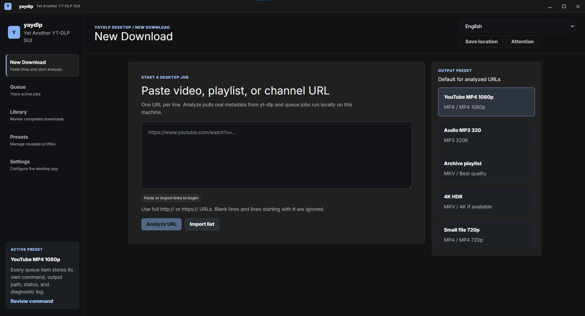

# yaydlp

Yet Another YT-DLP GUI is a desktop downloader for people who want the power of
`yt-dlp` without building every command by hand. Paste one or more video,
playlist, or channel URLs, review the metadata that `yt-dlp` finds, choose the
download profile you want, and run the jobs locally from a focused desktop UI.

The app is built with Rust and Dioxus. It manages its own `yt-dlp` and FFmpeg
binaries, keeps settings and completed-job history on the local machine, and
shows the generated command before a job is queued.

## Preview



## Features

- Analyze single videos, playlists, channels, and imported URL lists before
  downloading.
- Queue full video, audio-only, or video-only jobs.
- Select individual playlist entries, select all, select none, or quickly queue
  the first 10 items.
- Choose common video profiles such as best quality, MP4 1080p, MP4 720p, 4K if
  available, or video only.
- Extract audio to MP3, FLAC, M4A, Opus, or WAV with configurable quality.
- Manage reusable presets for format rules, containers, and output templates.
- Customize output folders and `yt-dlp` filename templates with a live preview.
- Configure subtitles, thumbnails, metadata embedding, cookies, proxy, retries,
  speed limits, concurrent fragments, and parallel jobs.
- Track queued, running, completed, and failed jobs with progress, speed, ETA,
  output hints, and diagnostic logs.
- Retry failed jobs and keep a local library of completed downloads.
- Switch the UI language between English and German.

## Quick Start

### Install On Windows

1. Open the [latest GitHub Release](https://github.com/Bilaal0x/yet-another-ytdlp-gui/releases/latest).
2. Download the latest `yaydlp-windows-x64.exe` from the release assets.
3. Move the portable `.exe` somewhere convenient, for example your Downloads
   folder or an apps folder. There is no installer wizard yet.
4. Double-click `yaydlp-windows-x64.exe` to start the app.
5. Open Settings and run the dependency check if `yt-dlp` or FFmpeg are not
   ready yet.

Windows SmartScreen may warn you the first time you run the downloaded `.exe`.
That can happen because the app is currently unsigned and does not have a paid
code-signing certificate or long SmartScreen reputation yet. Only run builds
downloaded from the official Releases page; if you trust the download, choose
More info and then Run anyway.

### Run From Source

#### Prerequisites

- Rust stable
- A Windows desktop environment for the currently supported release workflow
- Network access on first run so the app can install managed `yt-dlp` and FFmpeg

```powershell
cargo run --features desktop
```

The default feature set also includes `desktop`, so `cargo run` is usually
enough during local development.

On first launch, open Settings and use the dependency check if `yt-dlp` or
FFmpeg are not ready yet. Managed binaries are installed under the user's local
application data directory in `yaydlp/bin`.

## Typical Workflow

1. Paste one URL per line on the New Download screen, or import a `.txt`, `.csv`,
   or `.list` file.
2. Run analysis so `yt-dlp` can fetch real metadata.
3. Review the analyzed media, choose full video, audio-only, or video-only mode,
   and adjust format, audio, naming, or advanced options if needed.
4. Add selected items to the queue.
5. Start the queue and watch progress, logs, speed, ETA, and completion state.
6. Find completed jobs in the Library view and reveal their output folder.

## Development

Run the same commands used by CI:

```powershell
cargo fmt --all -- --check
cargo clippy --locked --features desktop --all-targets -- -D warnings
cargo test --locked --features desktop
cargo check --locked --features desktop
```

Build a debug desktop binary:

```powershell
cargo build --locked --features desktop
```

Build the Windows desktop release bundle with Dioxus CLI:

```powershell
dx build --release --desktop --locked
```

The GitHub release workflow uses Dioxus CLI `0.7.9` and publishes a single
Windows x64 executable named `yaydlp-windows-x64.exe`.

## Contributing Translations

yaydlp uses Fluent files for UI text. English is the fallback language, and the
currently registered languages are listed in `src/i18n.rs`.

To improve an existing translation:

1. Open the matching file in `locales/`, such as `locales/de.ftl`.
2. Keep every key name exactly the same as `locales/en.ftl`.
3. Translate only the text after `=`.
4. Preserve placeholders such as `{ $count }`, `{ $title }`, and `{ $path }`.
5. Preserve `is_rtl = false` unless the language reads right to left.
6. Run `cargo test --locked --features desktop` before opening a pull request.

To add a new language:

1. Copy `locales/en.ftl` to a new file such as `locales/fr.ftl`.
2. Translate the new file and set `language-name` to the native language name.
3. Add the language code and display name to `AVAILABLE_LANGUAGES` in
   `src/i18n.rs`.
4. Add the new file to `get_ftl_content` in `src/i18n.rs` with an
   `include_str!("../locales/<code>.ftl")` entry.
5. Run `cargo fmt --all` and `cargo test --locked --features desktop`.

If you want help before making a pull request, open a localization issue and
include the language, whether you want to add or improve it, and any screenshots
or awkward strings you noticed.

## Local Data

yaydlp keeps user data local:

- Settings: `%APPDATA%\YAMDL\settings.json`
- Completed download history: `%APPDATA%\YAMDL\library.json`
- Presets: `%APPDATA%\YAMDL\presets.json`
- Locale choice: `%APPDATA%\YAMDL\locale.txt`
- Managed binaries: local application data under `yaydlp/bin`

The selected cookie file path and proxy setting are stored with settings and
passed only to the local `yt-dlp` process. Use the Clear local history and
Forget cookie file actions in Settings when you want to remove saved state from
the app.

## Troubleshooting

- If downloads fail because `yt-dlp` or FFmpeg are missing, open Settings and
  run the dependency check again.
- If private, age-gated, or account-specific media fails, choose a cookie file in
  Advanced options and analyze the URL again.
- If a format is unavailable, re-run analysis and choose another quality or
  container profile.
- If network downloads are unstable, adjust proxy, retries, rate limit, and
  concurrent fragments in Advanced options or Queue settings.
- Open the debug output on failed jobs to see the exact `yt-dlp` output.

## Notes

yaydlp is a local wrapper around `yt-dlp`, so supported sites, formats, and
download behavior follow `yt-dlp` itself. Only download media when you have the
rights or permission to do so.
